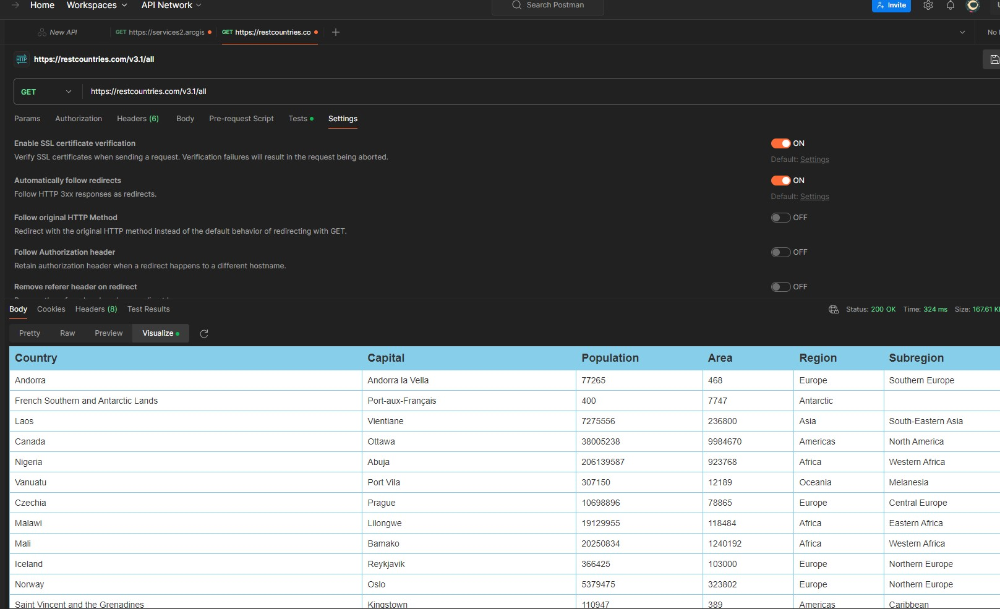
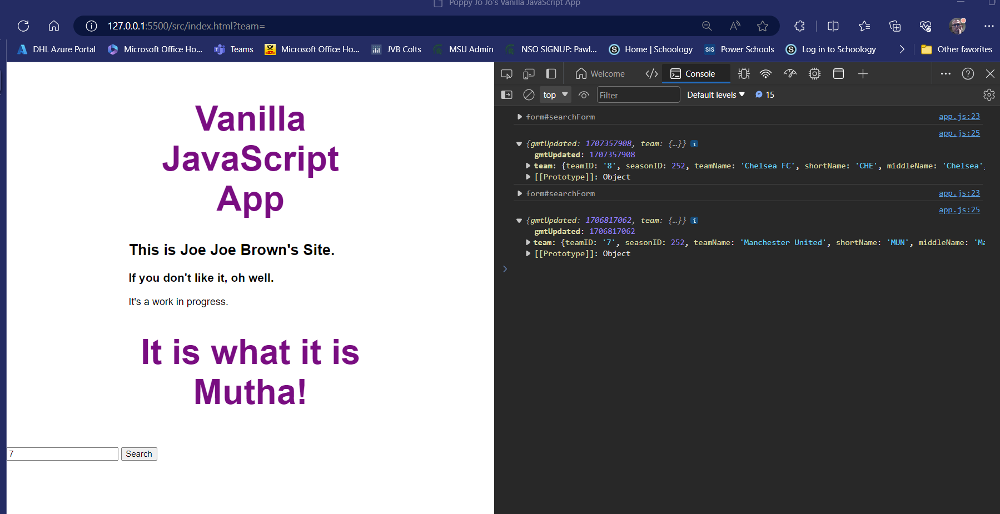
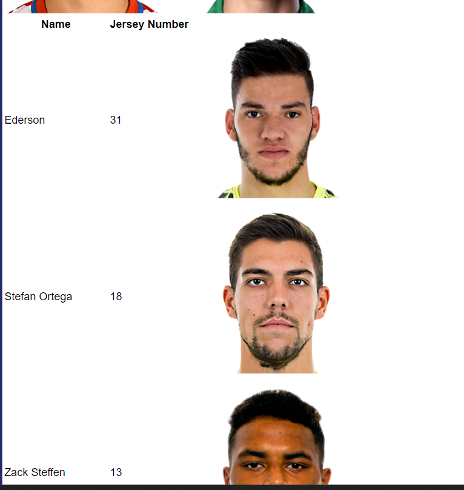

# Web Front End History

## Tuesday 1/9/24
Beginning to do some actual work. I've not gotten through all the Udemy training yet but, want to get started.

1. Got this history.md file created
2. Mucked around with the styles.css sheet.
3. Am reviewing Section 6 of the Udemy bootcamp
4. Updated the Readme with the actual Azure static website URL

## Tuesday 2/6/24
Stopping the Udemy class. Got through the API section. The rest of course appears to be Node JS and React. I will take what I've gone through and reference it as needed as I start building some type of web site. Not sure what yet. I envision a site that retrieves data from an API and displays it on the page in a table or graph. I can use the APIs I built using Azure Functions (in DHL account) or, another 3rd party source. I think I will:

1. Build a site connecting to 3rd party API to understand how to connect, bring data in, display it, pass search parameters etc.
2. I will use Google Charts to learn that software
3. Then, when I'm comfortable to move on, I can build the backend using SQL Server, Azure Function API (or another one of the rapid API building technologies from Microsoft) in my personal Azure account.
4. Then I can find a use case for building a front end to the tables to populate data. Use case perhaps in DHL.

**PROJECT**
Let's try working with this Countries rest API:
https://restcountries.com/

Looks simple. I loaded this endpoint in Postman and without having to do anything else, I got json of all the countries.
https://restcountries.com/v3.1/all


Done for today. Will now try to commit and sync with my github repo that, is connected to my static azure web page. Let's see if it works.

##Wednesday 2/7/24
Change of plans. I found the company that provides professional sports API and data: statorium.com
I spoke with a guy and set me up with an annual paid subscription ($50). I got an official API key and access to EPL data!
I tested some basic API calls using the key and confirmed that I can get to the data and it works!

Example:
####What league do I have access to?
https://api.statorium.com/api/v1/leagues/?apikey=0dc62921775ba39d7c2d0f630699b5c4

```
{
    "gmtUpdated": 1707311043,
    "leagues": [
        {
            "id": "1",
            "name": "ENGLAND: Premier League"
        }
    ]
}
```
#### What seasons do I have access to for my league?
 https://api.statorium.com/api/v1/leagues/1/?apikey=0dc62921775ba39d7c2d0f630699b5c4

 ```
 {
    "gmtUpdated": 1707311802,
    "league": {
        "id": "1",
        "name": "ENGLAND: Premier League",
        "logo": "https://api.statorium.com/media/bearleague/bl15562691252122.png",
        "seasons": [
            {
                "seasonID": "252",
                "seasonName": "2023-24"
            },
            {
                "seasonID": "165",
                "seasonName": "2022-23"
            },
            {
                "seasonID": "112",
                "seasonName": "2021-22"
            },
            {
                "seasonID": "59",
                "seasonName": "2020-21"
            },
            {
                "seasonID": "24",
                "seasonName": "2019-20"
            },
            {
                "seasonID": "1",
                "seasonName": "2018-19"
            }
        ]
    }
}
 ```

 ### What are the current standings (see gmtUpdated) for my league in chosen season?
 https://api.statorium.com/api/v1/standings/252?apikey=0dc62921775ba39d7c2d0f630699b5c4
 ```
 {
    "gmtUpdated": 1707300005,
    "season": {
        "seasonID": 252,
        "leagueID": "1",
        "seasonName": "2023-24",
        "fullName": "ENGLAND: Premier League 2023-24",
        "stages": false,
        "groups": [],
        "standings": [
            {
                "teamID": "3",
                "teamName": "Liverpool FC",
                "options": "{\"played_chk\":\"23\",\"winhome_chk\":\"9\",\"winaway_chk\":\"6\",\"drawhome_chk\":\"2\",\"drawaway_chk\":\"4\",\"losthome_chk\":\"0\",\"lostaway_chk\":\"2\",\"home_win_pts\":\"9\",\"away_win_pts\":\"6\",\"home_draw_pts\":\"2\",\"away_draw_pts\":\"4\",\"home_loose_pts\":\"0\",\"away_loose_pts\":\"2\",\"home_bonus\":\"0.00\",\"away_bonus\":\"0.00\",\"goalscore_chk\":\"52\",\"goalconc_chk\":\"22\",\"home_points\":\"0.00\",\"away_points\":\"0.00\",\"id\":\"3\",\"win_chk\":15,\"draw_chk\":6,\"lost_chk\":2,\"diff_chk\":\"52 - 22\",\"gd_chk\":30,\"point_chk\":51,\"bonuspts_chk\":0,\"percent_chk\":\"0.783\",\"pointshome_chk\":29,\"pointsaway_chk\":22,\"otwin_chk\":0,\"otlost_chk\":0}",
                "ordering": "1",
                "logo": "https://api.statorium.com/media/bearleague/bl16258353592797.png",
                "color": "#003300"
            },
            {
                "teamID": "4",
                "teamName": "Manchester City",
                "options": "{\"played_chk\":\"22\",\"winhome_chk\":\"7\",\"winaway_chk\":\"8\",\"drawhome_chk\":\"3\",\"drawaway_chk\":\"1\",\"losthome_chk\":\"0\",\"lostaway_chk\":\"3\",\"home_win_pts\":\"7\",\"away_win_pts\":\"8\",\"home_draw_pts\":\"3\",\"away_draw_pts\":\"1\",\"home_loose_pts\":\"0\",\"away_loose_pts\":\"3\",\"home_bonus\":\"0.00\",\"away_bonus\":\"0.00\",\"goalscore_chk\":\"54\",\"goalconc_chk\":\"25\",\"home_points\":\"0.00\",\"away_points\":\"0.00\",\"id\":\"4\",\"win_chk\":15,\"draw_chk\":4,\"lost_chk\":3,\"diff_chk\":\"54 - 25\",\"gd_chk\":29,\"point_chk\":49,\"bonuspts_chk\":0,\"percent_chk\":\"0.773\",\"pointshome_chk\":24,\"pointsaway_chk\":25,\"otwin_chk\":0,\"otlost_chk\":0}",
                "ordering": "2",
                "logo": "https://api.statorium.com/media/bearleague/bl15524863261959.png",
                "color": "#003300"
            },
            {
                "teamID": "9",
                "teamName": "Arsenal FC",
                "options": "{\"played_chk\":\"23\",\"winhome_chk\":\"9\",\"winaway_chk\":\"6\",\"drawhome_chk\":\"2\",\"drawaway_chk\":\"2\",\"losthome_chk\":\"1\",\"lostaway_chk\":\"3\",\"home_win_pts\":\"9\",\"away_win_pts\":\"6\",\"home_draw_pts\":\"2\",\"away_draw_pts\":\"2\",\"home_loose_pts\":\"1\",\"away_loose_pts\":\"3\",\"home_bonus\":\"0.00\",\"away_bonus\":\"0.00\",\"goalscore_chk\":\"47\",\"goalconc_chk\":\"22\",\"home_points\":\"0.00\",\"away_points\":\"0.00\",\"id\":\"9\",\"win_chk\":15,\"draw_chk\":4,\"lost_chk\":4,\"diff_chk\":\"47 - 22\",\"gd_chk\":25,\"point_chk\":49,\"bonuspts_chk\":0,\"percent_chk\":\"0.739\",\"pointshome_chk\":29,\"pointsaway_chk\":20,\"otwin_chk\":0,\"otlost_chk\":0}",
                "ordering": "3",
                "logo": "https://api.statorium.com/media/bearleague/bl15669942151527.png",
                "color": "#003300"
            },
            {
                "teamID": "112",
                "teamName": "Aston Villa",
                "options": "{\"played_chk\":\"23\",\"winhome_chk\":\"9\",\"winaway_chk\":\"5\",\"drawhome_chk\":\"1\",\"drawaway_chk\":\"3\",\"losthome_chk\":\"1\",\"lostaway_chk\":\"4\",\"home_win_pts\":\"9\",\"away_win_pts\":\"5\",\"home_draw_pts\":\"1\",\"away_draw_pts\":\"3\",\"home_loose_pts\":\"1\",\"away_loose_pts\":\"4\",\"home_bonus\":\"0.00\",\"away_bonus\":\"0.00\",\"goalscore_chk\":\"49\",\"goalconc_chk\":\"30\",\"home_points\":\"0.00\",\"away_points\":\"0.00\",\"id\":\"112\",\"win_chk\":14,\"draw_chk\":4,\"lost_chk\":5,\"diff_chk\":\"49 - 30\",\"gd_chk\":19,\"point_chk\":46,\"bonuspts_chk\":0,\"percent_chk\":\"0.696\",\"pointshome_chk\":28,\"pointsaway_chk\":18,\"otwin_chk\":0,\"otlost_chk\":0}",
                "ordering": "4",
                "logo": "https://api.statorium.com/media/bearleague/bl15650923042439.png",
                "color": "#003300"
            }
        ]
    }
}
```
####Team information for Chelsea
https://api.statorium.com/api/v1/teams/8?apikey=0dc62921775ba39d7c2d0f630699b5c4
```
{
    "gmtUpdated": 1707312228,
    "team": {
        "teamID": "8",
        "seasonID": 0,
        "teamName": "Chelsea FC",
        "shortName": "CHE",
        "middleName": "Chelsea",
        "city": "London",
        "logo": "https://api.statorium.com/media/bearleague/bl15524829401976.png",
        "homeVenue": {
            "name": "Stamford Bridge",
            "id": "11"
        },
        "bonusPoint": null,
        "additionalInfo": {
            "coach": null
        },
        "players": []
    }
}
```
####How to get player information for player ID 5
https://api.statorium.com/api/v1/players/5/?season_id=252&apikey=0dc62921775ba39d7c2d0f630699b5c4
```
{
    "gmtUpdated": 1707313179,
    "player": {
        "playerID": "5",
        "firstName": "Fuka Arthur",
        "lastName": "Masuaku Kawela",
        "shortName": "A. Masuaku",
        "fullName": "Arthur Masuaku",
        "homeName": "Fuka Arthur Masuaku Kawela",
        "country": {
            "name": "Congo, The Democratic Republic of the",
            "id": "51"
        },
        "currentTeam": {
            "name": null,
            "id": "0"
        },
        "photo": "https://api.statorium.com/media/bearleague/bl1554374651136.png",
        "additionalInfo": {
            "birthdate": "1993-11-07",
            "height": "179 cm",
            "weight": "70 kg",
            "position": "2"
        },
        "teams": []
    }
}
```

###Gets players from a team
https://api.statorium.com/api/v1/teams/8/?season_id=252&apikey=0dc62921775ba39d7c2d0f630699b5c4

```
{
    "gmtUpdated": 1707357908,
    "team": {
        "teamID": "8",
        "seasonID": 252,
        "teamName": "Chelsea FC",
        "shortName": "CHE",
        "middleName": "Chelsea",
        "city": "London",
        "logo": "https://api.statorium.com/media/bearleague/bl15524829401976.png",
        "homeVenue": {
            "name": "Stamford Bridge",
            "id": "11"
        },
        "bonusPoint": "0",
        "additionalInfo": {
            "coach": null
        },
        "players": [
            {
                "playerID": "15191",
                "teamID": 8,
                "firstName": "Cole Jermaine",
                "lastName": "Palmer",
                "shortName": "C. Palmer",
                "fullName": "Cole Palmer",
                "homeName": "Cole Jermaine Palmer",
                "country": {
                    "name": "England",
                    "id": "251"
                },
                "currentTeam": {
                    "name": null,
                    "id": "0"
                },
                "photo": "",
                "additionalInfo": {
                    "birthdate": "2002-05-06",
                    "height": "189 cm",
                    "weight": "72 kg",
                    "position": "3"
                },
                "playerNumber": "20",
                "playerDeparted": "0"
            },
            {
                "playerID": "115",
                "teamID": 8,
                "firstName": "Marcus",
                "lastName": "Bettinelli",
                "shortName": "M. Bettinelli",
                "fullName": "Marcus Bettinelli",
                "homeName": "",
                "country": {
                    "name": "England",
                    "id": "251"
                },
                "currentTeam": {
                    "name": null,
                    "id": "0"
                },
                "photo": "https://api.statorium.com/media/bearleague/bl15550624342570.png",
                "additionalInfo": {
                    "birthdate": "1992-05-24",
                    "height": "193 cm",
                    "weight": "82 kg",
                    "position": "1"
                },
                "playerNumber": "13",
                "playerDeparted": "0"
            },
            {
                "playerID": "3735",
                "teamID": 8,
                "firstName": "Wesley",
                "lastName": "Fofana",
                "shortName": "W. Fofana",
                "fullName": "Wesley Fofana",
                "homeName": "",
                "country": {
                    "name": "France",
                    "id": "74"
                },
                "currentTeam": {
                    "name": null,
                    "id": "0"
                },
                "photo": "https://api.statorium.com/media/bearleague/bl15648400521025.png",
                "additionalInfo": {
                    "birthdate": "2000-12-17",
                    "height": "190 cm",
                    "weight": "76 kg",
                    "position": "2"
                },
                "playerNumber": "33",
                "playerDeparted": "0"
            },
            {
                "playerID": "2298",
                "teamID": 8,
                "firstName": "Benoît",
                "lastName": "Badiashile Mukinayi",
                "shortName": "B. Badiashile",
                "fullName": "Benoît Badiashile",
                "homeName": "Benoît Badiashile Mukinayi",
                "country": {
                    "name": "France",
                    "id": "74"
                },
                "currentTeam": {
                    "name": null,
                    "id": "0"
                },
                "photo": "https://api.statorium.com/media/bearleague/bl15648341312689.png",
                "additionalInfo": {
                    "birthdate": "2001-03-26",
                    "height": "194 cm",
                    "weight": "77 kg",
                    "position": "2"
                },
                "playerNumber": "5",
                "playerDeparted": "0"
            },
            {
                "playerID": "29706",
                "teamID": 8,
                "firstName": "Levi Lemar Samuel",
                "lastName": "Colwill",
                "shortName": "L. Colwill",
                "fullName": "Levi Colwill",
                "homeName": "Levi Lemar Samuel Colwill",
                "country": {
                    "name": "England",
                    "id": "251"
                },
                "currentTeam": {
                    "name": null,
                    "id": "0"
                },
                "photo": "",
                "additionalInfo": {
                    "birthdate": "2003-02-26",
                    "height": "187 cm",
                    "weight": "75 kg",
                    "position": "2"
                },
                "playerNumber": "26",
                "playerDeparted": "0"
            }

        ]
    }
}

```

## Thursday 2/8/24

I was able to use the new EPL api to include it in a javacript and html POC. I called the Axios library using CDN, called the get method and put it in an async function and pulled back basic league data into a javascript json object. I used Udemy to walk me through and it all worked. Here are the results in Liveview


## ChatGPT answer to the question, how to parse json obj buit by axios into chart.js

Certainly! Let's break down the steps to achieve this:

1. **Fetching JSON Data with Axios**:
   To retrieve data from an API endpoint using Axios, you can make a GET request. Here's an example of how to do it:

    ```javascript
    const axios = require('axios');

    async function fetchDataFromApi() {
        try {
            const response = await axios.get('https://api.example.com/data'); // Replace with your API endpoint
            const jsonData = response.data; // Parsed JSON data
            return jsonData;
        } catch (error) {
            console.error('Error fetching data:', error);
        }
    }

    const apiData = await fetchDataFromApi();
    ```

2. **Creating a Chart with Chart.js**:
   Once you have the JSON data, you can use Chart.js to create a chart. First, make sure you include the Chart.js library in your HTML:

    ```html
    <script src="https://cdnjs.cloudflare.com/ajax/libs/Chart.js/3.7.0/chart.min.js"></script>
    ```

   Next, create an HTML canvas element where you want to render the chart:

    ```html
    <canvas id="myChart"></canvas>
    ```

   Finally, use the fetched JSON data to create your chart. For example, if your data contains labels and values for a bar chart:

    ```javascript
    const ctx = document.getElementById('myChart').getContext('2d');

    const chartData = {
        labels: apiData.labels, // Replace with your actual labels
        datasets: [{
            label: 'My Chart',
            data: apiData.values, // Replace with your actual data values
            backgroundColor: 'rgba(75, 192, 192, 0.2)',
            borderColor: 'rgba(75, 192, 192, 1)',
            borderWidth: 1,
        }],
    };

    new Chart(ctx, {
        type: 'bar',
        data: chartData,
        options: {
            responsive: true,
            maintainAspectRatio: false,
        },
    });
    ```

   Customize the chart type (e.g., line, bar, pie) and styling according to your needs.

Remember to replace the placeholder URLs and data with your actual API endpoint and JSON structure. Happy charting! 📊🎉

## Monday 2/12/24

I sucssfully modifed the javascript api call to take variables at the end of the strig including hard copying the api_key and the season since, these won't change.

I put a text input on an HTML form and a submit button. Inputting '8' in the text box and hitting Submit will take that team (chelsea) and append it to the api string along with the 'config' parameter that holds my season and api key.

It works and I can see it in the console log.



## Wednesday 2/14/24
Did a deep dive to understand what all the javascript is doing and documented.
At this point, the site is using Axios to connect to an API endpoint, bring in the json object, and pull the photo item from the object and display it in an image element in HTML.

## Thursday 2/15/24
Great progress in being able to read data from the API and put it into a table



## Friday 2/15/24
I added some formatting to the table using inline style tags. I also added a header title to the column of images in the table. Finally, I added an h3 tag that enclosed the team name.

## Monday 2/26/24
Leaving Javascript for now. I decided to re-focus on html/css. I want to take the simple table I built using the sanctorum API and begin to style it using DHL colors as an example. I want to take it a little bit further and see if I can design a site that is interactive, has menu layouts, is organized, receives inputs, etc. I want to create a DHL branded designed site that has Premiere League content. The goal is to envision what a final DHL site for AEMCE might look like and built it.

Today:
- Changed background color of the page to DHL yeller
- Changed the title and subtitles to DHL red
- Centered everything

I did this all in the CSS file.

I also noticed that , when I originally creted the table, I included in-line styling. I'll have to move this to the CSS file.


## Wednesday 2/28/24
Brushed up a little more on CSS to continue to layout the site. One thing I picked up from reviewing the Udemy training was what a **div** and **sp** is and how to use it in conjunction with CSS. It helps to know what an inline element is versus a block element. A block element takes up the whole page from left to right. An inline element takes up less than that and you can fit multiple inline elements on the same "line". Anything you put within a **div** element is essentially grouped together into a block element. It's a way to organize other elements. **sp** does the same but for inline elements.

Next, I'd like to take my three header elements and put them into **divs** or **sps** to play around with how to organize and layout the first part of my site. Also, play with CSS properties such as border colors, styles, etc.

## Thursday 2/29/24 (leapyear)
Played around a little with border and padding on the input text and button on the form using CSS properties. I put both of these in a div. Although, while both the header elements and this div element content are both block, they aren't rendering on the page the same way. The headers aren't spannning across the page but, are centered as if I've defined ad width and height. The inputbox and button are acting like a block element and spanning the whole width of the page. I think I'll begin to reference the HTML/CSS book I have to work more on the layout.

## Friday 3/1/24
Starting to learn about boostrap, which I want to use to help me layout my site. I reviewed videos #122 and #123 just to get started.

## Monday 3/4/24
All I did today was watch video #124 and included the bootstrap main css CDN and the accompanying javascript libraries and I inlcluded both in the index.html.

## Tuesday 3/6/24
Video #125. Added a button element to the html to test the connection to the cdn bootstrap library. seems to be working.

## Wednesday 3/7/24
No programming today. I'm at a bit of a crossroads on where to go from here. Options are:
- Develop Azure Function APIs into my own Azure SQL DB. I could develop a CRUD application.
- I could develop a javascript app that is a decision engine to use for the DPDB style guide
- I could work on trying to bring in Digital Gemb images and combine them with embedded power bi? I could use my personal power bi license to work on this

These all should be done but, I think I'll start with the javascrpt decision site and build a POC to see if this is a good solution for us. Plus, it will give me some good practice with javascript.

I will need to design and layout the POC and begin to build.

