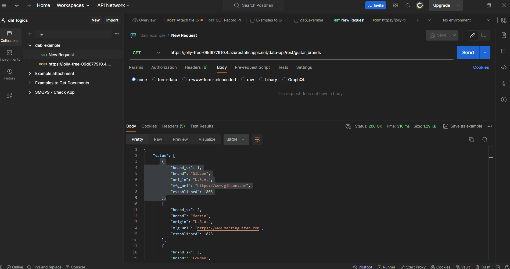
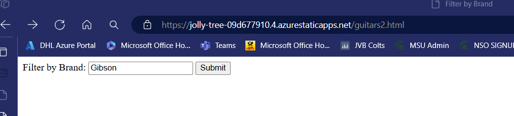

# Web Front End History

## Tuesday 1/9/24
Beginning to do some actual work. I've not gotten through all the Udemy training yet but, want to get started.

1. Got this history.md file created
2. Mucked around with the styles.css sheet.
3. Am reviewing Section 6 of the Udemy bootcamp
4. Updated the Readme with the actual Azure static website URL

## Tuesday 2/6/24
Stopping the Udemy class. Got through the API section. The rest of course appears to be Node JS and React. I will take what I've gone through and reference it as needed as I start building some type of web site. Not sure what yet. I envision a site that retrieves data from an API and displays it on the page in a table or graph. I can use the APIs I built using Azure Functions (in DHL account) or, another 3rd party source. I think I will:

1. Build a site connecting to 3rd party API to understand how to connect, bring data in, display it, pass search parameters etc.
2. I will use Google Charts to learn that software
3. Then, when I'm comfortable to move on, I can build the backend using SQL Server, Azure Function API (or another one of the rapid API building technologies from Microsoft) in my personal Azure account.
4. Then I can find a use case for building a front end to the tables to populate data. Use case perhaps in DHL.

**PROJECT**
Let's try working with this Countries rest API:
https://restcountries.com/

Looks simple. I loaded this endpoint in Postman and without having to do anything else, I got json of all the countries.
https://restcountries.com/v3.1/all


Done for today. Will now try to commit and sync with my github repo that, is connected to my static azure web page. Let's see if it works.

##Wednesday 2/7/24
Change of plans. I found the company that provides professional sports API and data: statorium.com
I spoke with a guy and set me up with an annual paid subscription ($50). I got an official API key and access to EPL data!
I tested some basic API calls using the key and confirmed that I can get to the data and it works!

Example:
####What league do I have access to?
https://api.statorium.com/api/v1/leagues/?apikey=0dc62921775ba39d7c2d0f630699b5c4

```
{
    "gmtUpdated": 1707311043,
    "leagues": [
        {
            "id": "1",
            "name": "ENGLAND: Premier League"
        }
    ]
}
```
#### What seasons do I have access to for my league?
 https://api.statorium.com/api/v1/leagues/1/?apikey=0dc62921775ba39d7c2d0f630699b5c4

 ```
 {
    "gmtUpdated": 1707311802,
    "league": {
        "id": "1",
        "name": "ENGLAND: Premier League",
        "logo": "https://api.statorium.com/media/bearleague/bl15562691252122.png",
        "seasons": [
            {
                "seasonID": "252",
                "seasonName": "2023-24"
            },
            {
                "seasonID": "165",
                "seasonName": "2022-23"
            },
            {
                "seasonID": "112",
                "seasonName": "2021-22"
            },
            {
                "seasonID": "59",
                "seasonName": "2020-21"
            },
            {
                "seasonID": "24",
                "seasonName": "2019-20"
            },
            {
                "seasonID": "1",
                "seasonName": "2018-19"
            }
        ]
    }
}
 ```

 ### What are the current standings (see gmtUpdated) for my league in chosen season?
 https://api.statorium.com/api/v1/standings/252?apikey=0dc62921775ba39d7c2d0f630699b5c4
 ```
 {
    "gmtUpdated": 1707300005,
    "season": {
        "seasonID": 252,
        "leagueID": "1",
        "seasonName": "2023-24",
        "fullName": "ENGLAND: Premier League 2023-24",
        "stages": false,
        "groups": [],
        "standings": [
            {
                "teamID": "3",
                "teamName": "Liverpool FC",
                "options": "{\"played_chk\":\"23\",\"winhome_chk\":\"9\",\"winaway_chk\":\"6\",\"drawhome_chk\":\"2\",\"drawaway_chk\":\"4\",\"losthome_chk\":\"0\",\"lostaway_chk\":\"2\",\"home_win_pts\":\"9\",\"away_win_pts\":\"6\",\"home_draw_pts\":\"2\",\"away_draw_pts\":\"4\",\"home_loose_pts\":\"0\",\"away_loose_pts\":\"2\",\"home_bonus\":\"0.00\",\"away_bonus\":\"0.00\",\"goalscore_chk\":\"52\",\"goalconc_chk\":\"22\",\"home_points\":\"0.00\",\"away_points\":\"0.00\",\"id\":\"3\",\"win_chk\":15,\"draw_chk\":6,\"lost_chk\":2,\"diff_chk\":\"52 - 22\",\"gd_chk\":30,\"point_chk\":51,\"bonuspts_chk\":0,\"percent_chk\":\"0.783\",\"pointshome_chk\":29,\"pointsaway_chk\":22,\"otwin_chk\":0,\"otlost_chk\":0}",
                "ordering": "1",
                "logo": "https://api.statorium.com/media/bearleague/bl16258353592797.png",
                "color": "#003300"
            },
            {
                "teamID": "4",
                "teamName": "Manchester City",
                "options": "{\"played_chk\":\"22\",\"winhome_chk\":\"7\",\"winaway_chk\":\"8\",\"drawhome_chk\":\"3\",\"drawaway_chk\":\"1\",\"losthome_chk\":\"0\",\"lostaway_chk\":\"3\",\"home_win_pts\":\"7\",\"away_win_pts\":\"8\",\"home_draw_pts\":\"3\",\"away_draw_pts\":\"1\",\"home_loose_pts\":\"0\",\"away_loose_pts\":\"3\",\"home_bonus\":\"0.00\",\"away_bonus\":\"0.00\",\"goalscore_chk\":\"54\",\"goalconc_chk\":\"25\",\"home_points\":\"0.00\",\"away_points\":\"0.00\",\"id\":\"4\",\"win_chk\":15,\"draw_chk\":4,\"lost_chk\":3,\"diff_chk\":\"54 - 25\",\"gd_chk\":29,\"point_chk\":49,\"bonuspts_chk\":0,\"percent_chk\":\"0.773\",\"pointshome_chk\":24,\"pointsaway_chk\":25,\"otwin_chk\":0,\"otlost_chk\":0}",
                "ordering": "2",
                "logo": "https://api.statorium.com/media/bearleague/bl15524863261959.png",
                "color": "#003300"
            },
            {
                "teamID": "9",
                "teamName": "Arsenal FC",
                "options": "{\"played_chk\":\"23\",\"winhome_chk\":\"9\",\"winaway_chk\":\"6\",\"drawhome_chk\":\"2\",\"drawaway_chk\":\"2\",\"losthome_chk\":\"1\",\"lostaway_chk\":\"3\",\"home_win_pts\":\"9\",\"away_win_pts\":\"6\",\"home_draw_pts\":\"2\",\"away_draw_pts\":\"2\",\"home_loose_pts\":\"1\",\"away_loose_pts\":\"3\",\"home_bonus\":\"0.00\",\"away_bonus\":\"0.00\",\"goalscore_chk\":\"47\",\"goalconc_chk\":\"22\",\"home_points\":\"0.00\",\"away_points\":\"0.00\",\"id\":\"9\",\"win_chk\":15,\"draw_chk\":4,\"lost_chk\":4,\"diff_chk\":\"47 - 22\",\"gd_chk\":25,\"point_chk\":49,\"bonuspts_chk\":0,\"percent_chk\":\"0.739\",\"pointshome_chk\":29,\"pointsaway_chk\":20,\"otwin_chk\":0,\"otlost_chk\":0}",
                "ordering": "3",
                "logo": "https://api.statorium.com/media/bearleague/bl15669942151527.png",
                "color": "#003300"
            },
            {
                "teamID": "112",
                "teamName": "Aston Villa",
                "options": "{\"played_chk\":\"23\",\"winhome_chk\":\"9\",\"winaway_chk\":\"5\",\"drawhome_chk\":\"1\",\"drawaway_chk\":\"3\",\"losthome_chk\":\"1\",\"lostaway_chk\":\"4\",\"home_win_pts\":\"9\",\"away_win_pts\":\"5\",\"home_draw_pts\":\"1\",\"away_draw_pts\":\"3\",\"home_loose_pts\":\"1\",\"away_loose_pts\":\"4\",\"home_bonus\":\"0.00\",\"away_bonus\":\"0.00\",\"goalscore_chk\":\"49\",\"goalconc_chk\":\"30\",\"home_points\":\"0.00\",\"away_points\":\"0.00\",\"id\":\"112\",\"win_chk\":14,\"draw_chk\":4,\"lost_chk\":5,\"diff_chk\":\"49 - 30\",\"gd_chk\":19,\"point_chk\":46,\"bonuspts_chk\":0,\"percent_chk\":\"0.696\",\"pointshome_chk\":28,\"pointsaway_chk\":18,\"otwin_chk\":0,\"otlost_chk\":0}",
                "ordering": "4",
                "logo": "https://api.statorium.com/media/bearleague/bl15650923042439.png",
                "color": "#003300"
            }
        ]
    }
}
```
####Team information for Chelsea
https://api.statorium.com/api/v1/teams/8?apikey=0dc62921775ba39d7c2d0f630699b5c4
```
{
    "gmtUpdated": 1707312228,
    "team": {
        "teamID": "8",
        "seasonID": 0,
        "teamName": "Chelsea FC",
        "shortName": "CHE",
        "middleName": "Chelsea",
        "city": "London",
        "logo": "https://api.statorium.com/media/bearleague/bl15524829401976.png",
        "homeVenue": {
            "name": "Stamford Bridge",
            "id": "11"
        },
        "bonusPoint": null,
        "additionalInfo": {
            "coach": null
        },
        "players": []
    }
}
```
####How to get player information for player ID 5
https://api.statorium.com/api/v1/players/5/?season_id=252&apikey=0dc62921775ba39d7c2d0f630699b5c4
```
{
    "gmtUpdated": 1707313179,
    "player": {
        "playerID": "5",
        "firstName": "Fuka Arthur",
        "lastName": "Masuaku Kawela",
        "shortName": "A. Masuaku",
        "fullName": "Arthur Masuaku",
        "homeName": "Fuka Arthur Masuaku Kawela",
        "country": {
            "name": "Congo, The Democratic Republic of the",
            "id": "51"
        },
        "currentTeam": {
            "name": null,
            "id": "0"
        },
        "photo": "https://api.statorium.com/media/bearleague/bl1554374651136.png",
        "additionalInfo": {
            "birthdate": "1993-11-07",
            "height": "179 cm",
            "weight": "70 kg",
            "position": "2"
        },
        "teams": []
    }
}
```

###Gets players from a team
https://api.statorium.com/api/v1/teams/8/?season_id=252&apikey=0dc62921775ba39d7c2d0f630699b5c4

```
{
    "gmtUpdated": 1707357908,
    "team": {
        "teamID": "8",
        "seasonID": 252,
        "teamName": "Chelsea FC",
        "shortName": "CHE",
        "middleName": "Chelsea",
        "city": "London",
        "logo": "https://api.statorium.com/media/bearleague/bl15524829401976.png",
        "homeVenue": {
            "name": "Stamford Bridge",
            "id": "11"
        },
        "bonusPoint": "0",
        "additionalInfo": {
            "coach": null
        },
        "players": [
            {
                "playerID": "15191",
                "teamID": 8,
                "firstName": "Cole Jermaine",
                "lastName": "Palmer",
                "shortName": "C. Palmer",
                "fullName": "Cole Palmer",
                "homeName": "Cole Jermaine Palmer",
                "country": {
                    "name": "England",
                    "id": "251"
                },
                "currentTeam": {
                    "name": null,
                    "id": "0"
                },
                "photo": "",
                "additionalInfo": {
                    "birthdate": "2002-05-06",
                    "height": "189 cm",
                    "weight": "72 kg",
                    "position": "3"
                },
                "playerNumber": "20",
                "playerDeparted": "0"
            },
            {
                "playerID": "115",
                "teamID": 8,
                "firstName": "Marcus",
                "lastName": "Bettinelli",
                "shortName": "M. Bettinelli",
                "fullName": "Marcus Bettinelli",
                "homeName": "",
                "country": {
                    "name": "England",
                    "id": "251"
                },
                "currentTeam": {
                    "name": null,
                    "id": "0"
                },
                "photo": "https://api.statorium.com/media/bearleague/bl15550624342570.png",
                "additionalInfo": {
                    "birthdate": "1992-05-24",
                    "height": "193 cm",
                    "weight": "82 kg",
                    "position": "1"
                },
                "playerNumber": "13",
                "playerDeparted": "0"
            },
            {
                "playerID": "3735",
                "teamID": 8,
                "firstName": "Wesley",
                "lastName": "Fofana",
                "shortName": "W. Fofana",
                "fullName": "Wesley Fofana",
                "homeName": "",
                "country": {
                    "name": "France",
                    "id": "74"
                },
                "currentTeam": {
                    "name": null,
                    "id": "0"
                },
                "photo": "https://api.statorium.com/media/bearleague/bl15648400521025.png",
                "additionalInfo": {
                    "birthdate": "2000-12-17",
                    "height": "190 cm",
                    "weight": "76 kg",
                    "position": "2"
                },
                "playerNumber": "33",
                "playerDeparted": "0"
            },
            {
                "playerID": "2298",
                "teamID": 8,
                "firstName": "Benoît",
                "lastName": "Badiashile Mukinayi",
                "shortName": "B. Badiashile",
                "fullName": "Benoît Badiashile",
                "homeName": "Benoît Badiashile Mukinayi",
                "country": {
                    "name": "France",
                    "id": "74"
                },
                "currentTeam": {
                    "name": null,
                    "id": "0"
                },
                "photo": "https://api.statorium.com/media/bearleague/bl15648341312689.png",
                "additionalInfo": {
                    "birthdate": "2001-03-26",
                    "height": "194 cm",
                    "weight": "77 kg",
                    "position": "2"
                },
                "playerNumber": "5",
                "playerDeparted": "0"
            },
            {
                "playerID": "29706",
                "teamID": 8,
                "firstName": "Levi Lemar Samuel",
                "lastName": "Colwill",
                "shortName": "L. Colwill",
                "fullName": "Levi Colwill",
                "homeName": "Levi Lemar Samuel Colwill",
                "country": {
                    "name": "England",
                    "id": "251"
                },
                "currentTeam": {
                    "name": null,
                    "id": "0"
                },
                "photo": "",
                "additionalInfo": {
                    "birthdate": "2003-02-26",
                    "height": "187 cm",
                    "weight": "75 kg",
                    "position": "2"
                },
                "playerNumber": "26",
                "playerDeparted": "0"
            }

        ]
    }
}

```

## Thursday 2/8/24

I was able to use the new EPL api to include it in a javacript and html POC. I called the Axios library using CDN, called the get method and put it in an async function and pulled back basic league data into a javascript json object. I used Udemy to walk me through and it all worked. Here are the results in Liveview


## ChatGPT answer to the question, how to parse json obj buit by axios into chart.js

Certainly! Let's break down the steps to achieve this:

1. **Fetching JSON Data with Axios**:
   To retrieve data from an API endpoint using Axios, you can make a GET request. Here's an example of how to do it:

    ```javascript
    const axios = require('axios');

    async function fetchDataFromApi() {
        try {
            const response = await axios.get('https://api.example.com/data'); // Replace with your API endpoint
            const jsonData = response.data; // Parsed JSON data
            return jsonData;
        } catch (error) {
            console.error('Error fetching data:', error);
        }
    }

    const apiData = await fetchDataFromApi();
    ```

2. **Creating a Chart with Chart.js**:
   Once you have the JSON data, you can use Chart.js to create a chart. First, make sure you include the Chart.js library in your HTML:

    ```html
    <script src="https://cdnjs.cloudflare.com/ajax/libs/Chart.js/3.7.0/chart.min.js"></script>
    ```

   Next, create an HTML canvas element where you want to render the chart:

    ```html
    <canvas id="myChart"></canvas>
    ```

   Finally, use the fetched JSON data to create your chart. For example, if your data contains labels and values for a bar chart:

    ```javascript
    const ctx = document.getElementById('myChart').getContext('2d');

    const chartData = {
        labels: apiData.labels, // Replace with your actual labels
        datasets: [{
            label: 'My Chart',
            data: apiData.values, // Replace with your actual data values
            backgroundColor: 'rgba(75, 192, 192, 0.2)',
            borderColor: 'rgba(75, 192, 192, 1)',
            borderWidth: 1,
        }],
    };

    new Chart(ctx, {
        type: 'bar',
        data: chartData,
        options: {
            responsive: true,
            maintainAspectRatio: false,
        },
    });
    ```

   Customize the chart type (e.g., line, bar, pie) and styling according to your needs.

Remember to replace the placeholder URLs and data with your actual API endpoint and JSON structure. Happy charting! 📊🎉

## Monday 2/12/24

I sucssfully modifed the javascript api call to take variables at the end of the strig including hard copying the api_key and the season since, these won't change.

I put a text input on an HTML form and a submit button. Inputting '8' in the text box and hitting Submit will take that team (chelsea) and append it to the api string along with the 'config' parameter that holds my season and api key.

It works and I can see it in the console log.


## Wednesday 2/14/24
Did a deep dive to understand what all the javascript is doing and documented.
At this point, the site is using Axios to connect to an API endpoint, bring in the json object, and pull the photo item from the object and display it in an image element in HTML.

## Thursday 2/15/24
Great progress in being able to read data from the API and put it into a table


## Friday 2/15/24
I added some formatting to the table using inline style tags. I also added a header title to the column of images in the table. Finally, I added an h3 tag that enclosed the team name.

## Monday 2/26/24
Leaving Javascript for now. I decided to re-focus on html/css. I want to take the simple table I built using the sanctorum API and begin to style it using DHL colors as an example. I want to take it a little bit further and see if I can design a site that is interactive, has menu layouts, is organized, receives inputs, etc. I want to create a DHL branded designed site that has Premiere League content. The goal is to envision what a final DHL site for AEMCE might look like and built it.

Today:
- Changed background color of the page to DHL yeller
- Changed the title and subtitles to DHL red
- Centered everything

I did this all in the CSS file.

I also noticed that , when I originally creted the table, I included in-line styling. I'll have to move this to the CSS file.


## Wednesday 2/28/24
Brushed up a little more on CSS to continue to layout the site. One thing I picked up from reviewing the Udemy training was what a **div** and **sp** is and how to use it in conjunction with CSS. It helps to know what an inline element is versus a block element. A block element takes up the whole page from left to right. An inline element takes up less than that and you can fit multiple inline elements on the same "line". Anything you put within a **div** element is essentially grouped together into a block element. It's a way to organize other elements. **sp** does the same but for inline elements.

Next, I'd like to take my three header elements and put them into **divs** or **sps** to play around with how to organize and layout the first part of my site. Also, play with CSS properties such as border colors, styles, etc.

## Thursday 2/29/24 (leapyear)
Played around a little with border and padding on the input text and button on the form using CSS properties. I put both of these in a div. Although, while both the header elements and this div element content are both block, they aren't rendering on the page the same way. The headers aren't spannning across the page but, are centered as if I've defined ad width and height. The inputbox and button are acting like a block element and spanning the whole width of the page. I think I'll begin to reference the HTML/CSS book I have to work more on the layout.

## Friday 3/1/24
Starting to learn about boostrap, which I want to use to help me layout my site. I reviewed videos #122 and #123 just to get started.

## Monday 3/4/24
All I did today was watch video #124 and included the bootstrap main css CDN and the accompanying javascript libraries and I inlcluded both in the index.html.

## Tuesday 3/6/24
Video #125. Added a button element to the html to test the connection to the cdn bootstrap library. seems to be working.

## Wednesday 3/7/24
No programming today. I'm at a bit of a crossroads on where to go from here. Options are:
- Develop Azure Function APIs into my own Azure SQL DB. I could develop a CRUD application.
- I could develop a javascript app that is a decision engine to use for the DPDB style guide
- I could work on trying to bring in Digital Gemb images and combine them with embedded power bi? I could use my personal power bi license to work on this

These all should be done but, I think I'll start with the javascrpt decision site and build a POC to see if this is a good solution for us. Plus, it will give me some good practice with javascript.

I will need to design and layout the POC and begin to build.

## Tuesday 6/4/24
I've decided to pursue trying to connct to my persoal Azure SQL DB via Microsoft Data API Builder.

### Step One - Install locally
I've installed the CLI tool following the instructions from Microsoft here:
https://learn.microsoft.com/en-us/azure/data-api-builder/how-to-install-cli

Everything seems to have installed corrctly and I have version 1.1.7. This is now in general availability.


### Step Two - Deploy to Azure Static Web App
Had to install Static Web App CLI first:
npm install -g @azure/static-web-apps-cli

swa db init --database-type mssql

dab add guitar_brands --source dbo.guitar_brands --permissions "anonymous:*" --config "swa-db-connections/staticwebapp.database.config.json"

I entered the above in the terminal window and it all worked.

I then went through the instructions in the rest of this to connect the DB in my static website and it actually Works!!!

https://learn.microsoft.com/en-us/azure/data-api-builder/how-to-deploy-static-web-app


I can't belive how easy this was to connect my static web app to my database.
That's it for today. I will work to create some api end points to pull dat from this database next into a table in my website.

super exciting.


https://jolly-tree-09d677910.4.azurestaticapps.net/data-api/rest/guitar_brands

## Wednesday 6/5/24

https://github.com/Azure/data-api-builder

So, couple issues, when I try to run this in the browser:
https://jolly-tree-09d677910.4.azurestaticapps.net/data-api/rest/guitar_brands

It takes a couple page refreshes to get it to load, not sure why.

Also, I can't get this to run locally easily because:

1. I can't use dab start due to the default config name not matching the expeted default. I think I found a way around this by puting in some parameters into the config cli like this:

PS C:\Users\pawlo\my-first-static-web-app2> dab start --config swa-db-connections/staticwebapp.database.config.json
Information: Microsoft.DataApiBuilder 1.1.7
Information: User provided config file: swa-db-connections/staticwebapp.database.config.json
Loading config file from swa-db-connections/staticwebapp.database.config.json.
Information: Loaded config file: swa-db-connections/staticwebapp.database.config.json
Error: Invalid connection-string provided in the config.
Error: Failed to start the engine.

But, as you can see, while I think it's finding the file, the connection string is blank. That doesn't seem to be a problem while syncing this and loading it to the SWA but, it is when trying to run locally. I can live without running it locally for now. I'll just have to test by loading to swa always.

I think I'll try to create a simple web page that connects to the rest api endpoint I create and brings the json data into a table.

## Monday 6/17/24
Ok, progress to date:

I hav a Azure Static Website built:
my-first-static-web-app2

I contacted the Premiere League and signed up for an API.

I made a website that connects to the API
https://jolly-tree-09d677910.4.azurestaticapps.net/

I build and workon the site in VS Code and sync to Github which automatically publishes to Azure Static Web App

I hae a free database in Azure.

I made a table called Guitar Brands

I connected that table in Azure to the Static Web app

I used the DAB CLI to create an end point, hosted in the SWA connected to the database.

I can successfully test that it works by going here and refreshing three times (not sure why it doesn't work the first time)

https://jolly-tree-09d677910.4.azurestaticapps.net/data-api/rest/guitar_brands

Supposedly, end point can handle all the api verbs.

Also, you can just put ODA directly into the URL strig like:

https://jolly-tree-09d677910.4.azurestaticapps.net/data-api/rest/guitar_brands?$filter=brand eq 'Gibson'

I'll try to use that in my new webpage and I'll also try to use each verb.

## Tuesday 6/18/24

Today I was able to create an HTML page that loaded guitar info using the DAB api.

Here's how it works:

1. Create an HTML page
   1. Load the AXIOS CDN script URL
   2. Load the script pointing to app2.js (created this new too)
2. Create app2.js
   1. Just did a simple axios command that points to the DAB created API URL in the static web app I built. I did a console log to display the results.

Note:
It wouldn't run locally and I was getting a CORS error. I found out that that happens when I try to run locally in LiveServer.

I published this and ran it live and I was able to get results:


## Wednesday 6/19/24

OK. I can use the DAB REST API endpoint to GET data from my Azure SQL DB connected and through the Azure Static Web App.

I wanted to start to understand how I can use the POST verb to create a new record. I figure if I can do that, PUSH and DELETE should be pretty simple.

I wasn't sure if there was a separate discreet Endpoint but, I was thinking I use the same Endpoint but just use a different verb in the type. I just assume that the default was GET or something like that.

Rather than try to mock something up in HTML and javascript, etc. I thought I'd take all that out of the equatio and just use Postman. After some back-and-forth, I got it to work.

I created a Collection called "dab_example".

The first thing I did was to test the GET. Again, after TWO executions (like when I post the URL directly into the browser), I got it to work:



I was fooling around with the POST to create a new record. I wasn't sure how to configure POSTMAN especially to pass the payload. I watched this video and it was helpful.

https://www.youtube.com/watch?v=rZILP_3OP-A

I also referred to this Microsoft DAB documentation:

https://learn.microsoft.com/en-us/azure/data-api-builder/rest

I got what looked like 'non error' results in POSTMAN.


The key was to load the payload in raw form and ensure content-type is json:


I re-ran the GET but didn't see the new record. 

I went the Azure Portal to look at the database content and saw the new record!!


## Thursday 6/20/24

Just started to create the form (guitars.html) that I'll use to collect the guitar brand information that I hope to send to the DAB API using POST method to add a new record to my database.

If this works, it's much easier than using Azure Functions.

## Monday 6/24/24

I'm beginning to build out some form data. The first thing I want to do is to uild a search form that allows a user to enter a brand of guitar in a text box, hit enter and pass the ODATA query to the website and return json.

Here's what I paste into the URL:

`https://jolly-tree-09d677910.4.azurestaticapps.net/data-api/rest/guitar_brands?$filter=brand eq 'Gibson'`

Here's what it looks like in the URL after hitting Enter:

`https://jolly-tree-09d677910.4.azurestaticapps.net/data-api/rest/guitar_brands?$filter=brand%20eq%20%27Gibson%27`

Here's the result:


I tried to put some generic Form code in:


```html
<form action="https://jolly-tree-09d677910.4.azurestaticapps.net/data-api/rest/guitar_brands" method="get">
  <label for="brand">Brand:</label>
  <input type="text" id="brand" name="brand"><br><br>
  <input type="submit" value="Submit">
</form>
```


And got this:

`https://jolly-tree-09d677910.4.azurestaticapps.net/data-api/rest/guitar_brands?brand=Gibson`


## Tuesday 6/25/24

Wow. Bing is cool. I didn't even write a stitch of code and I got the results I want.

I was trying to find a way to use the ODATA query method to filter results from my API. The first few attemts resulted in in URI encoding issues but, ultimately, I was able to get some code from Bing that worked.

I started a stand alone HTML file, guitars2.html tha returned the correct URL and thus the correct results.

URL:

`https://jolly-tree-09d677910.4.azurestaticapps.net/data-api/rest/guitar_brands?$filter=brand%20eq%20%27Gibson%27`




From here, I think I can understand the queries I would like in my page and figure out the write html/javascript.

I'll also need to figure out how to receive the JSON and put it in a table.

I also have the results of successful POST command in POstman. I need to create this in HTML/javascript next

## Wednesday 6/26/24

Lots of experimentation trying to code up POST. Trying Axios, Fetch, etc. No luck. Unresolved errors. It works in Postman so...

And just as I was trying one more thing and shutting everyting down, it works!!!!!!!

The html file guitars_post.html with title Filter by Brand Post 5. I was taking suggestions and tryig to POST Form data but went to JSON payload using Axios. I hit enter and got nice clean Console with no errors.

guitars_post.html


## Thursday 6/27/24

Quickly able to take the work done to create ODATA search query on the guitar brand API and return results into a table.

See guitars4.html


All the guitar*.html files work but use different methods. For GET, I think I'll stick with AXIOS

Next I need to figure out how to just request ALL the records into a table. Maybe figure out how to call the first 20 records and have ability to sort, etc.

