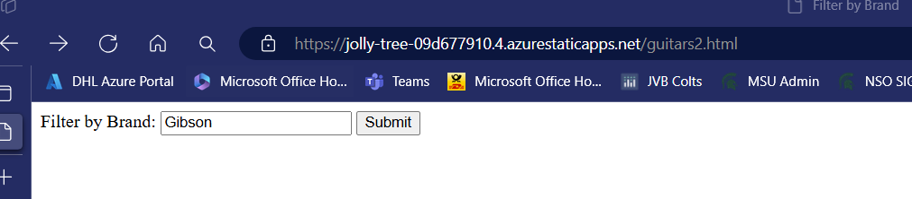
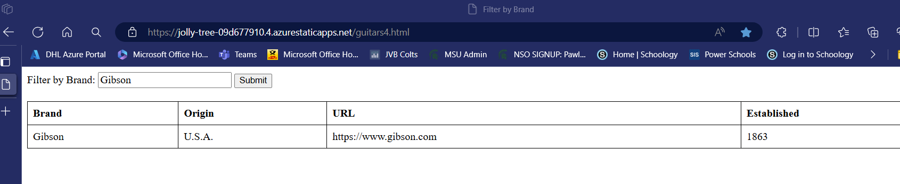
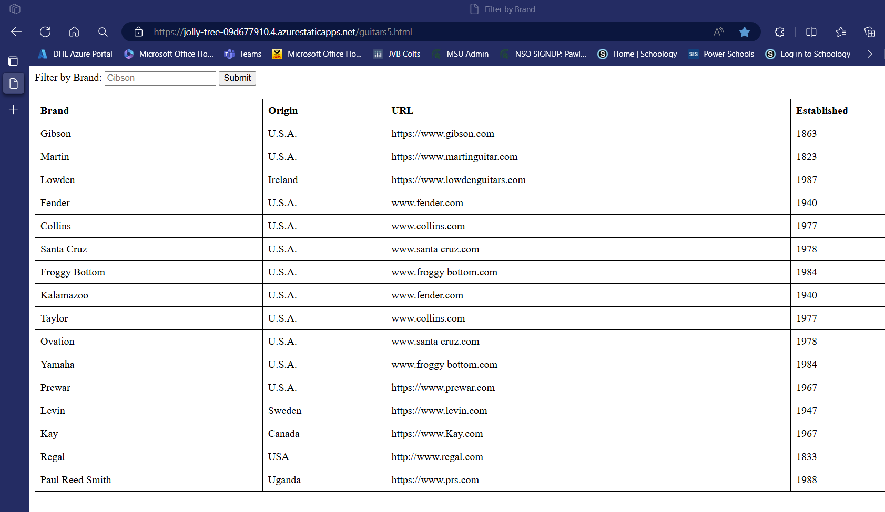
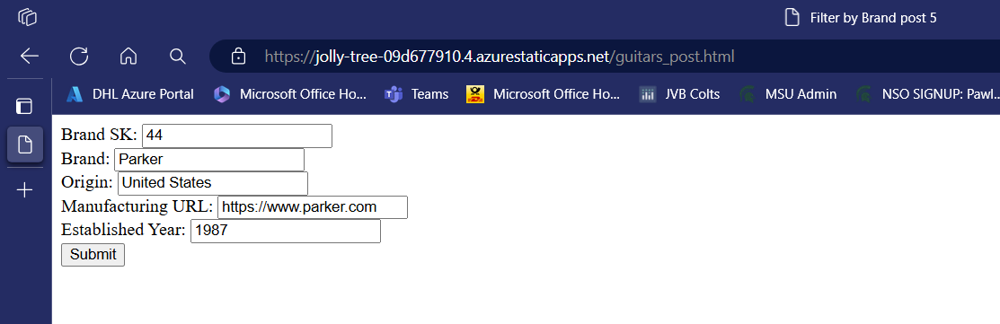

# Reference

[My Vanilla Javascript Azure Static Website](https://jolly-tree-09d677910.4.azurestaticapps.net/) *<== Click Here*

[My Github Repo](https://github.com/pawlowski6132/my-first-static-web-app2/tree/main/src) *<== Click Here*

[MDN CSS Reference](https://developer.mozilla.org) *<== Click Here*

[Markdown Reference](https://www.markdownguide.org/basic-syntax) *<== Click Here*

[Axios Github Reference](https://github.com/axios/axios#installing) *<== Click Here*

AXIOS CDN
https://cdn.jsdelivr.net/npm/axios@1.1.2/dist/axios.min.js

***
##API
statorium api key 0dc62921775ba39d7c2d0f630699b5c4
username: j.pawlowski6132
password: 61326132Bb*
[statorium](https://statorium.com/) *<== Click Here*

6/17/24
Link to Static Website with API built from DAB:
https://jolly-tree-09d677910.4.azurestaticapps.net/data-api/rest/guitar_brands
(same site as the Preiere league api site)

Web Pages

https://jolly-tree-09d677910.4.azurestaticapps.net/guitars.html

1. Example of all the form input types
2. I don't think the search filters on this page work.

https://jolly-tree-09d677910.4.azurestaticapps.net/guitars2.html

1. This page works. Type in 'Gibson' and it returns results in the form of JSON.

https://jolly-tree-09d677910.4.azurestaticapps.net/guitars3.html

1. This page doesn't seem to work. Submit button doesn't do anything. Supposed to be filter by grand like guitars2-html

https://jolly-tree-09d677910.4.azurestaticapps.net/guitars4.html

1. This works nice. The filter works AND the results are put in a table.

https://jolly-tree-09d677910.4.azurestaticapps.net/guitars5.html

1. Regardless of what's in the filter, this returns everything in the sql table and puts it into a table on the page

https://jolly-tree-09d677910.4.azurestaticapps.net/guitars_post.html

1. This post works. But, after hitting submit, there is no feedback. We have to check the table in SSMS to see if it worked.
2. This also has be be done a few times like the other GET api calls where it doesn't work at first for some reason.

REST APIs

https://jolly-tree-09d677910.4.azurestaticapps.net/data-api/rest/guitar_brands

1. When put into the brower URL gives these results

https://jolly-tree-09d677910.4.azurestaticapps.net/data-api/rest/workload

1. When put into the browser URL gives these results:

